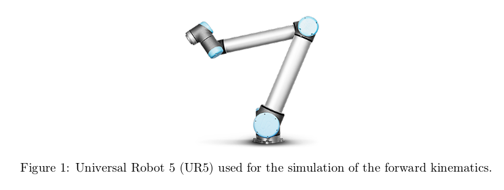

# Robotics homework

# Introduction

Make a simulation of a UR5 in CoppeliaSim, using python and ZeroMQ Remote API. 



- [ ] Investigate [Denavit-Hartenberg parameters](https://www.mdpi.com/2218-6581/11/6/137) of the UR5 
- [ ] Install dependecies: `pyzmq, cbor, numpy, argparse, time, textwrap`
- [ ] Make a `venv`
- [ ] Follow the steps in [Procedures](#procedures)

# Submission 

- [ ] **Upload your CoppeliaSim scene to Blackboard**. This should be ready for testing and be configure to be interfaced from Python using the Remote API.
- [ ] **Upload your Jupyter Notebook to Blackboard**. It is expected to run properly when tested using Python 3.10.
- [ ] **Include a demo video (10min approx.), face recording is need, where you explain steps from 3 to 16.**
- [ ] Add your personal conclusions at the end of your Jupyter Notebook.
- [ ] What would you like to learn/add to this assignment if you had to complete it just for fun and for the sole intention of learning more about this topic/simulator?
- [ ] Add references.

# Procedures

1. Work on the CoppeliSim simulator to become familiar with the virtualised UR5 robot.
2. From the Scene hierarchy window, identify the links and joints that are part of the UR5.
3. Configure the Python Child Script.
4. Open your Jupyter Notebook.
5. Import the required Python libraries.
6. Create a client to get connected to the zmqRemoteApi from CoppeliaSim.
7. Get the handles of joints and links.
8. Start simulation.
9. Define the rotation angle of each joint.
10. Implement the forward-kinematics equations to predict the robot’s end-effector position. Feel free to use the homogeneous matrix representation or the Denavit-Hartenberg description first then the homogeneous matrix representation.
11. Print the robot’s end effector position with respect to the robot’s base coordinate system.
12. Move the robot by applying the instruction sim.setJointTargetPosition(jointx, anglex) to every joint of the UR5 robot. jointx and anglex were defined in step 9.
13. Get the actual position of the robot’s end-effector.
14. Compare the predicted and the actual robot’s end-effector positions.
15. Discuss your results in detail.
16. Set all joints to a 0o rotation angle.
17. Repeat steps 9 to 15 according to the following Table 1 (NB. Add as many code cells to your Jupyter Notebook as needed in order to test the following joints configurations):

| Run | θ1  | θ2   | θ3  | θ4  | θ5  | Predicted position (X,Y,Z) | Actual position (X,Y,Z) |
| --- | --- | ---  | --- | --- | --- | ---                        | ---                     |
| 1   | 20° | 30°  | 15° | 5°  | 45° |                            |                         |
| 2   | 0°  | −90° | 90° | 0°  | 90° |                            |                         |
| 3   | 0°  | 10°  | 20° | 30° | 40° |                            |                         |

# UR5 Specifications

## Denavit-Hartenberg parameters

You can find the kinematics specifications [here][link_ur5_specifications].

[Video sobre el tema](https://www.youtube.com/watch?v=z9yJu5ndQ48)

$$
H_i^{i-1} = Rot_z(\theta_i) \rarr T(0,0,d_i) \rarr T(a_i, 0, 0) \rarr Rotx(\alpha_i)
$$

> Multiplicando estas transformaciones, podemos obtener la matriz de transformacion

Se pueden obtener la *matriz homogenea* para cada *joint* si se aplican las transformaciones enlistadas anteriormente:

$$
H_i^{i-1} = 

\begin{bmatrix}
R(\theta_i) & 0 \\
0 & 1
\end{bmatrix}

\begin{bmatrix}
0 & d_z \\
0 & 1
\end{bmatrix}

\begin{bmatrix}
0 & a_x \\
0 & 1
\end{bmatrix}

\begin{bmatrix}
R(\alpha_i) & 0 \\
0 & 1
\end{bmatrix}
$$

Para obtener la matriz de transformacion final, se puede hacer lo siguiente: 

$$
T_f = \prod^n_{i=1}H_i
$$

*Table of Kinematics*

| Kinematics | $\theta$ [rad] | a [m]   | d [m]  | $\alpha$ [rad] |
| ---------- | ----------  | ----    | ----   | ----------  |
| Joint 1    | 0           | 0       | 0.1625 | 1.570       |
| Joint 2    | 0           | -0.425  | 0      | 0           |
| Joint 3    | 0           | -0.3922 | 0      | 0           |
| Joint 4    | 0           | 0       | 0.1333 | 1.570       |
| Joint 5    | 0           | 0       | 0.0997 | -1.570      |
| Joint 6    | 0           | 0       | 0.0996 | 0           |

| Kinematics | theta [rad] | a [m]   | d [m]  | alpha [rad] |
| ---------- | ----------  | ----    | ----   | ----------  |
| Joint 1    | 0           | 0       | 0.1625 | 1.570       |
| Joint 2    | 0           | -0.425  | 0      | 0           |
| Joint 3    | 0           | -0.3922 | 0      | 0           |
| Joint 4    | 0           | 0       | 0.1333 | 1.570       |
| Joint 5    | 0           | 0       | 0.0997 | -1.570      |
| Joint 6    | 0           | 0       | 0.0996 | 0           |


# Developers

## Jupyter lab

To run jupyter lab, run the command: `./jupyter.sh`

## Venv

```bash
python -m venv final-exam-venv
source ./final-exam-venv/bin/activate
pip install -r requirements.txt
```

[link_ur5_specifications]:https://www.universal-robots.com/articles/ur/application-installation/dh-parameters-for-calculations-of-kinematics-and-dynamics/
